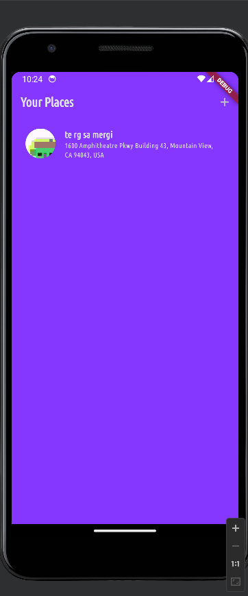
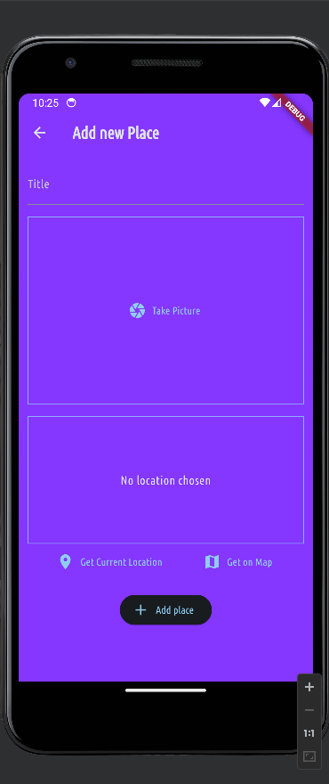
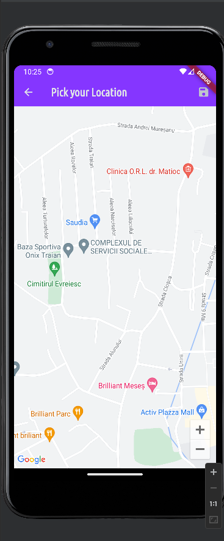
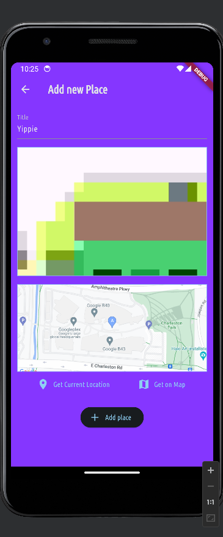
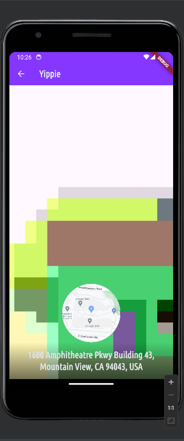

# Add Locations

Application in which I learned about:
- Using native device features (camera)
- Persisting data locally
- Using Google Maps API in Flutter [In java I learned here](https://github.com/Matrei3/Java-Radio)
- Configuring maps
- Working with images

## Final Result

